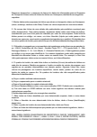

# Projeto de banco de dados

Deseja-se desenvolver o esquema do banco de dados de informações para as Empresas
de Transporte Urbano sobre as linhas de ônibus em Araraquara, atendendo aos seguintes
requisitos:

1. Manter dados sobre empresas de ônibus que atuam no transporte urbano em Araraquara
(nome, endereço, telefone e site Web). Podem ser várias empresas em uma única cidade.

2. Os nomes das linhas de uma cidade são padronizados pela prefeitura municipal para
evitar desencontros. Para cada empresa, armazenar dados sobre suas linhas de ônibus,
considerando que uma linha pode ser atendida por mais de uma empresa. Cada linha de
ônibus possui um código, um nome, um único itinerário (trajeto por onde passa a linha
durante seu percurso, envolvendo a sequência dos logradouros e sentido). Ela também tem
um único quadro de horário para cada linha por dia (feriados/sábados/domingos/dias úteis).

3. O itinerário é composto por uma sequência de logradouros onde situam-se as paradas (p.
ex.: LINHA Fonte/Altos da Vila Xavier - Sentido Fonte-TCI:1 - CTA (ponto final); 2 - Rua
Domingos Barbieri, 3 - Av. Luiz Alberto, 4 - Alameda Paulista, etc.). Cada logradouro possui
um código e um nome para identificá-lo. Um mesmo logradouro pode estar presente nos
itinerários de diferentes linhas e, várias vezes na mesma linha. Por exemplo, a Rua 9 de
Julho pode aparecer várias vezes na mesma linha e, em linhas diferentes.

4. O quadro de horário de cada linha indica os horários (hh:mm) de saídas de ônibus em
cada dia da semana. Mantém-se apenas o horário na saída do veículo da empresa, sem
registrar-se as paradas intermediárias nos demais pontos. Algumas linhas têm maior
volume de passageiros em horários específicos, sendo assim, podem ter mais de um
horário de saída no mesmo dia. Os quadros de horários não são compartilhados pelas
diferentes linhas/itinerários.

a) Faça o modelo entidade-relacionamento.

b) Faça o mapeamento para o modelo relacional.

c) Faça a Normalização do modelo relacional obtido.

d) Crie as Tabelas obtidas no item c com suas restrições (OBS: Cuidado com a sequência)
e) Crie uma base no SGBD definido em aula. 

Insira registros nas tabelas criadas para
manipularmos consultas.

f) Nesta etapa deste projeto crie as seguintes consultas:

1. Obter todas as linhas atendidas por uma determinada empresa, dado o nome dessa
empresa.

2. Obter o itinerário de uma determinada linha de ônibus, dado o Nome (Identificação)
dessa linha.

3. Obter o quadro de horário de uma determinada linha, dado seu Nome.

4. Obter as linhas de ônibus/empresa que passam por um determinado logradouro, dado o
nome desse logradouro.

OBS: INSIRA DADOS (QUANTIDADE DE REGISTROS E DADOS “ADEQUADOS”. NÃO
INSIRA, POR EXEMPLO: LINHA 1, LINHA 2, RUA 1, RUA 2, ENTRE OUTROS). DESSA
FORMA AS CONSULTAS PODERÃO APRESENTAR RESULTADOS COERENTES.

